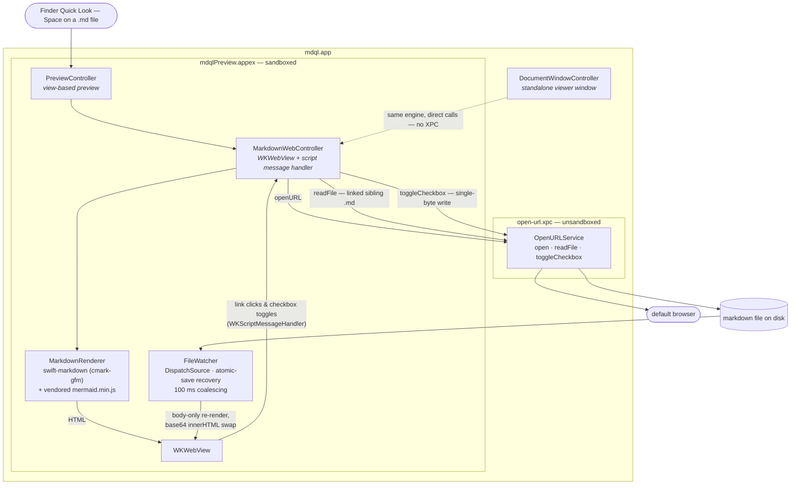

# mdql

A macOS Quick Look extension for previewing Markdown files. Press Space on any `.md` file in Finder to see a rendered preview — with **live updates** as the file changes.


## Features

- **Live preview** — edit a Markdown file and watch the QuickLook preview update in real-time
- **GitHub Flavored Markdown** — tables, task lists, strikethrough, fenced code blocks with language hints
- **Follow `.md` links** — click a relative `.md`/`.markdown` link to navigate to that file inside the same preview, with a back button and hover status bar showing where each link goes
- **Tick things off** — task-list checkboxes are clickable, and the change is written straight back into the file
- **Standalone viewer** — `mdql.app` opens a `.md` file in its own window, rendered exactly as the preview renders it
- **Light & dark mode** — automatically follows system appearance
- **Inkpad-inspired styling** — clean typography with thoughtful spacing and color tokens. Big shout out to Mariusz and Matt for the epic work together on Inkpad nearly a decade ago
- **Fast** — uses Apple's [swift-markdown](https://github.com/swiftlang/swift-markdown) (cmark-gfm) for native-speed parsing

## Requirements

- macOS 26.0+
- Xcode 26+ (to build from source)

## Install

Download the zip from the [latest release](https://github.com/larskluge/mdql/releases/latest), unzip it, and drag `mdql.app` to `/Applications`. **Launch it once** — macOS only discovers the Quick Look extension when its host app has been opened, so a copy that is dragged in and never opened previews nothing. Then press Space on any `.md` file in Finder.

Every release is signed with a Developer ID certificate and notarized by Apple, so it opens with a plain double-click — no right-click-Open workaround.

Prefer to build it yourself? **From source** is right below.

### From source

```bash
make install
```

This builds a Release binary, copies it to `/Applications/`, cleans up all stale DerivedData and duplicate registrations, registers the QuickLook extension, and verifies everything is correct. Press Space on any `.md` file in Finder to preview.

## Test

```bash
make test
```

The release tooling's Python suite first — it needs nothing installed and takes milliseconds — then the Xcode tests. GitHub Actions runs both on every push to `main` and every pull request.

## Architecture

Five Xcode targets in one app: a sandboxed Quick Look extension does the previewing, an unsandboxed XPC service embedded inside it does the things the sandbox forbids, and the host app doubles as a standalone viewer that skips the XPC hop entirely.



See [docs/live-updates.md](docs/live-updates.md) for why the live-update path looks like this.

## How Live Updates Work

QuickLook extensions run in a strict sandbox that blocks the obvious approaches (JS polling, embedded HTTP server, WebSocket, SSE). See [docs/live-updates.md](docs/live-updates.md) for the full write-up on what fails, what works (view-based preview + WKWebView + DispatchSource FileWatcher + base64 innerHTML injection), and why installation location matters.
