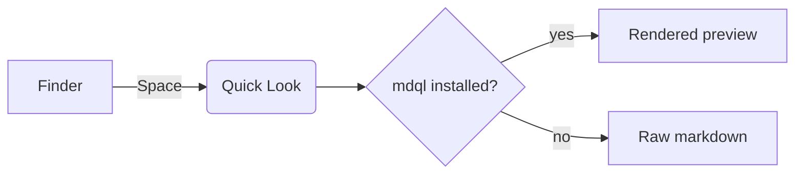
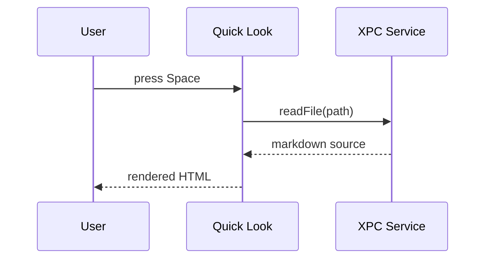
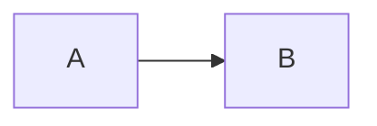

# Mermaid fixture

## Flowchart


```mermaid
flowchart LR
    A[Finder] -->|Space| B(Quick Look)
    B --> C{mdql installed?}
    C -->|yes| D[Rendered preview]
    C -->|no| E[Raw markdown]
```

## Sequence diagram


```mermaid
sequenceDiagram
    participant U as User
    participant QL as Quick Look
    participant X as XPC Service
    U->>QL: press Space
    QL->>X: readFile(path)
    X-->>QL: markdown source
    QL-->>U: rendered HTML
```

## Simple flowchart


```mermaid
flowchart LR
    A --> B
```

## Normal code block stays a code block

```swift
let x = 42
```
